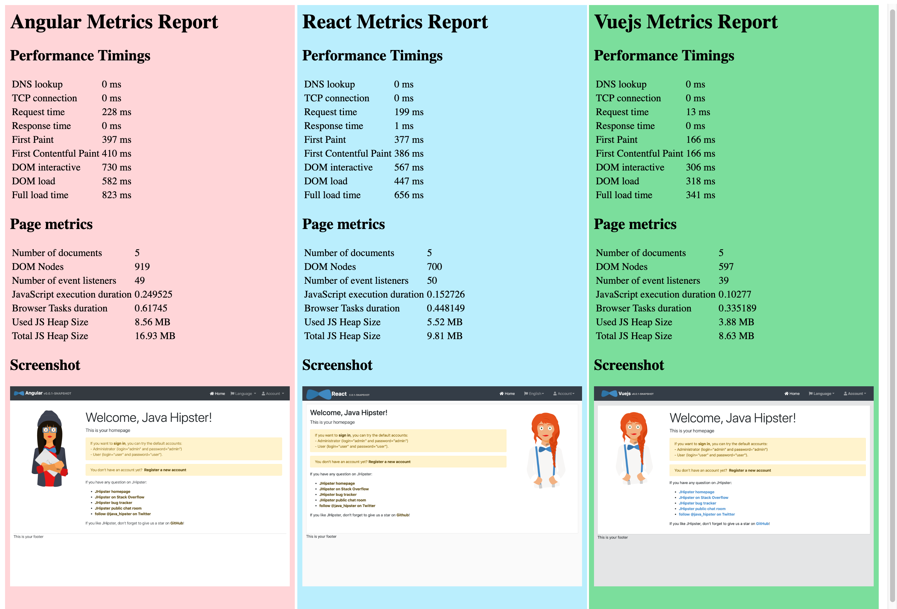
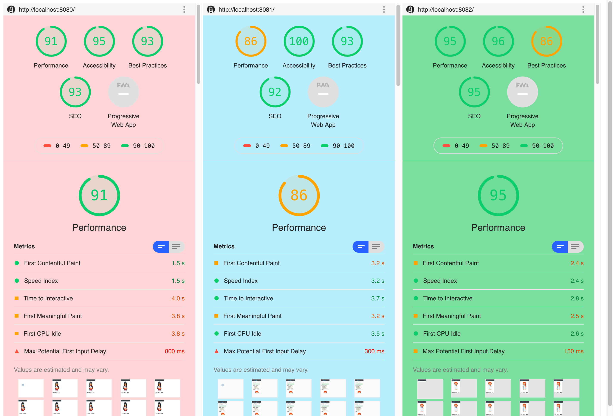
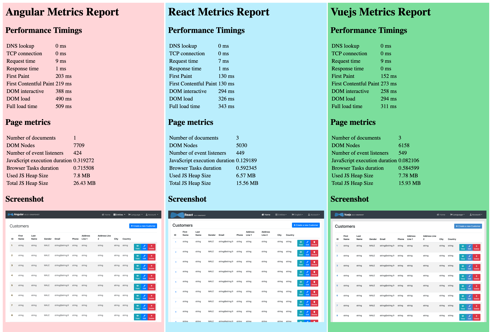
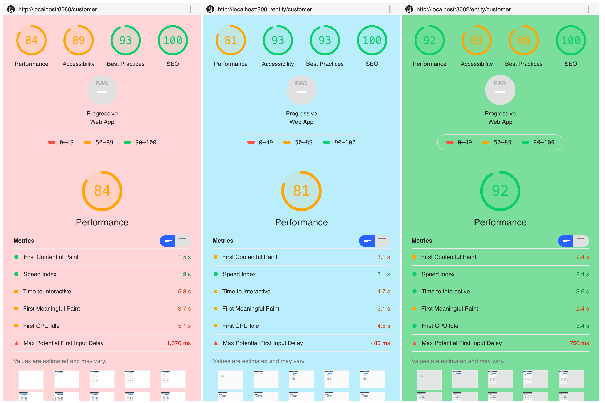

# Angular vs React vs Vue.js with JHipster 6.1.2

  * [Results](#results)
    + [Round 1](#round-1)
    + [Round 2](#round-2)
  * [Run apps](#run-apps)
  * [Run tests](#run-tests)
    + [Homepage](#homepage)
    + [Entity](#entity)

## Results

### Round 1

### Round 2

### Bundles

TODO

## Run apps

As the docker images have been pre-published to docker-hub, starting the the demo is as simple as running :

    ./3-run-apps.sh

Your applications will be accessible on these URLs:

- angular: http://localhost:8080
- react: http://localhost:8081
- vuejs: http://localhost:8082

## Run tests

### Homepage

    cd performance-tests
    npm i
    npm run homepage

### Entity

    npm run entity
